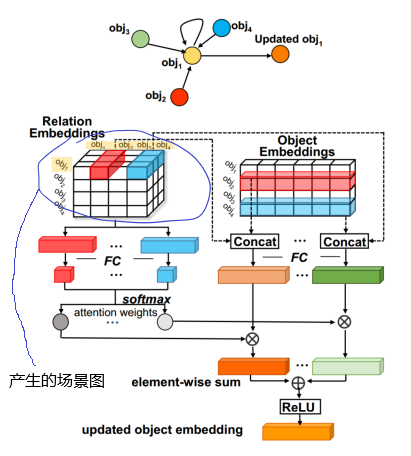
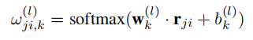
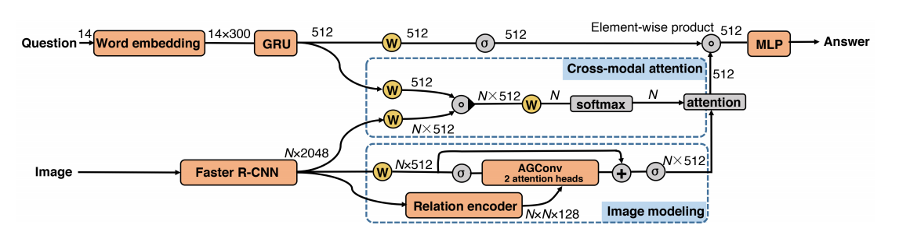
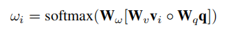
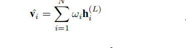

## Abstract  

In this work, we explore to model relations by contextual-sensitive embeddings based on human priori knowledge. We novelly propose a plug-and-play relation reasoning module injected with the relation embeddings to enhance image encoder. Specifically, we design upgraded Graph Convolutional Networks (GCN) to utilize the information of relation embeddings and relation directionality between objects for generating relation-aware image representations.

## Detail 

### 1 先用一个简单的网络产生场景图  

###  2  Anisotropic Graph Convolution(AGConv) 

名字比较高大上，其实就是mutil-head的self-attention机制 

对应公式，$||$ 表示拼接，$h_{j}^{l}$表示第$j$个物体，$l$层的特征

### 3 类似于 Botton-up,top-down类似的结构进行VQA  

Cross-wise product的公式是： 

然后进行权重和，最后预测：

