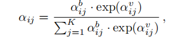
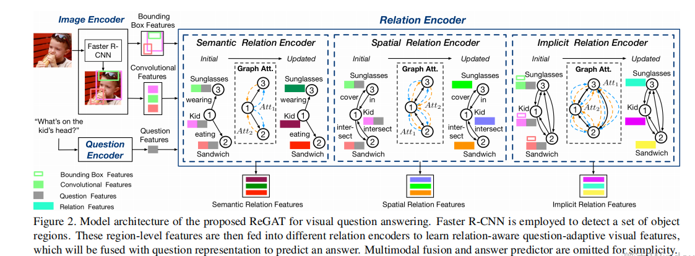
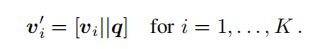
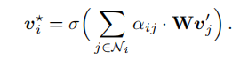
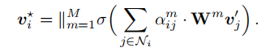
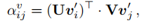
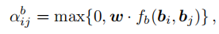
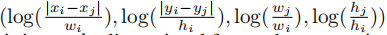
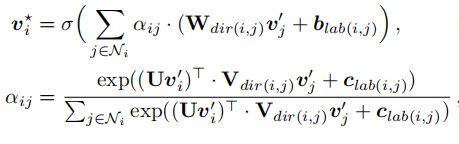
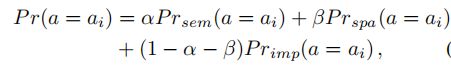

## Abstract

We propose a Relation-aware Graph Attention Network (ReGAT), which encodes each image into a graph and models multi-type inter-object relations via a graph attention mechanism, to learn question-adaptive relation representations. Two types of visual object relations are explored: (i) Explicit Relations that represent geometric positions and semantic interactions between objects; and (ii) Implicit Relations that capture the hidden dynamics between image regions.

## Detail  



### 1 经过Faster-Rcnn 检测，提特征  

### 2 图的建立

​    建立了两个不同的图，Spatial Graph，Semantic Graph  

#### Spatial Graph

这个图是基本对称的，1和2有位置关系，那么2和1也有位置关系，但是类别是不一样的，没有关系反过来也没有关系。

将两两目标间的位置关系分为11类：

#### Semantic Graph  

这个图是不对称的，1和2关系，2和1不一定有关系。这篇文章将语义关系分为了14类(visual genome data set)。

这两个图的建立都是基于[Exploring visual relationship for image captioning](https://arxiv.org/abs/1809.07041)


###3 Relation Encoder  

##### 对问题进行编码：

编码思路：不同类型的关系，可能对应于不同的问题，所以采用自适应的编码，将分配较大的权重于最和问题相关的部分。( For the VQA task, there might be different types of relation that are useful for different
question types. Thus, in designing the relation encoder, we use a question-adaptive attention mechanism to inject semantic information from the question into relation graphs,to dynamically assign higher weights to those relations that are mostly relevant to each question)

首先，拼接编码后的问题$q$和每一个实例特征$v_{i}$




然后用一个self-attention机制更新每个特征：



$\sigma$是$Relu$ 函数,实现的时候采用的mutil-head机制  



###   

* Implicit Relation(这个是另外一个用于预测答案的网络)：

  不仅通过图像特征求权重，还通过位置信息求权重  

  






$f_{b}(b_{i},b_{j})$是计算四个特征的函数，并且通过在不同的位置($+2\pi$)计算，将四个特征映射到$d$维



* Explicit Relation(这个是用于上面建立的两个子图更新特征)

  ### 这块更没看懂  

  

$b_{lab(i,j)},c_{lab(i,j)}$论文中都没有明确告诉该怎么求 ,原文如下

```
dir(i, j) selects the transformation matrix wrt the directionality of each edge, and lab(i, j) represents the label of each edge
```

### 4 预测

更新完特征后，需要将问题$q$与$v^{*}$进行融合，这里采用了三个不同的融合方法(也没有细讲)

[ Bottom-up Top-down](https://arxiv.org/pdf/1707.07998.pdf)

[Multimodal Tucker Fusion](https://arxiv.org/abs/1705.06676)

[Bilinear Attention Network](https://arxiv.org/abs/1805.07932)

融合以后，因为有三个不同的预测模型，在训练的时候分开训练，预测是进行融合，手动设置权重进行融合  

